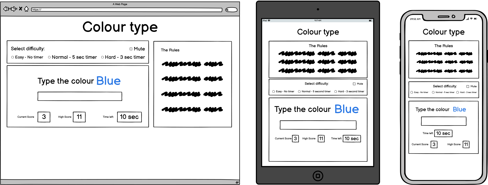

# Colour Type
Here is a link to the live project. (https://delboy.github.io/Colour-Type/)

I decided to make a game that was inspired by a neuropsychological test that I discovered a few years back. The test shows you a series of words that spell one colour but are coloured in another and asks you to speak out the colour of the word and not the word itself. I thought I could make this into a game where not only the word and colour changes but the question of whether to spell out either the word or the colour also changes. 

## Design
- __Colour Scheme__
    - I wanted to keep the colour scheme plain and simple as to not distract the user from the colouring of the question word. I liked the idea of the game looking like it was scribbled on a white board so I kept the main colours of the site black and white. 
- __Typography__
    - The game only uses the font 'indie flower' as it has a whiteboard pen-like handwritting quality which gives the page a game school game feel. Sans sarif was used as a fall back font incase of any problems loading the page.
- __Wireframes__
    
## Features
- __Title__
- This title sits at the top of the page showing the user the name of the game as soon as they land on the site. Being that the game is all about colour I decided to animate the title to cycle through a bunch of different colours. 
- __Rule Area__
- The rule area explains the rules of the game, giving two examples to aid the user. 
- On desktop the rules are easily visible to the right of the game area. 
- If using a smaller screen, to save space, the rule area is initially hidden. Clicking the downward chevron next to the 'how to play' link displays the rules in the center of the screen.
- On tablet size screens touching the 'x' in the top right corner will close the rules.
- On mobile size screens touching touching the rules anywhere will close it.
- __Options Area__
- Here the user can change the difficulty of the game and also choose wether to mute the sound or not. 
- Changing the difficulty does two things. It affects both the amount of time to answer each question and how many points are awarded for each question answered correctly. 
- The difficulty settings disables when the game starts and re-enables when the game ends. This is to stop the user from changing difficulty halfway through a round. 
- The mute checkbox can be checked and unchecked at anytime during play.
- __Game Area__
- The game area consists of: 
     - A 'start game btn' which runs the game. This button disables once the game is running and re-enables when the game ends.
     - A question area where the current question will be displayed and a text box for the user to enter thier answer.
     - A Timer showing how many seconds left till the game ends. 
     - A score area which displays the users current score and thier high score.
- The enter/return key can also be used to start the game.
- The answer box will flash red for a split second if an incorrect answer is entered. It will aslo play an incorrect sound effect.
- If the user enters a correct answer it will play a correct sound effect.
- The timer also plays a 'ticking' sound effect every second that passes by.
- __Feedback Area__
- This section is hidden until the round finishes on which it will display a message to the user noting them of thier score and possible new high score. It will also encourage them to play again. 
- If the user scores a new highscore a fanfare sound effect will play and the page will briefly flash through a range of colours.
- If the user dosnt beat thier highscore a win sound effect will play.
- If the user scores 0 a lose sound effect will play and the message will ask the user if they read the rules.
- Hitting the enter/return key or clicking the feeback box will close it.

## Testing
- __Validators__
- __Further Testing__
- __Bugs__

## Deployment

## Credits
- I learned how to add audio from [this] thread (https://stackoverflow.com/questions/9419263/how-to-play-audio) on stackoverflow.com.
- All sounds were sourced from [Freesounds.org](https://freesound.org/).
- Clipboard pic was sourced from https://www.subpng.com/png-co8iji/download.html.
- Box https://www.pngwing.com/en/free-png-bbrpb