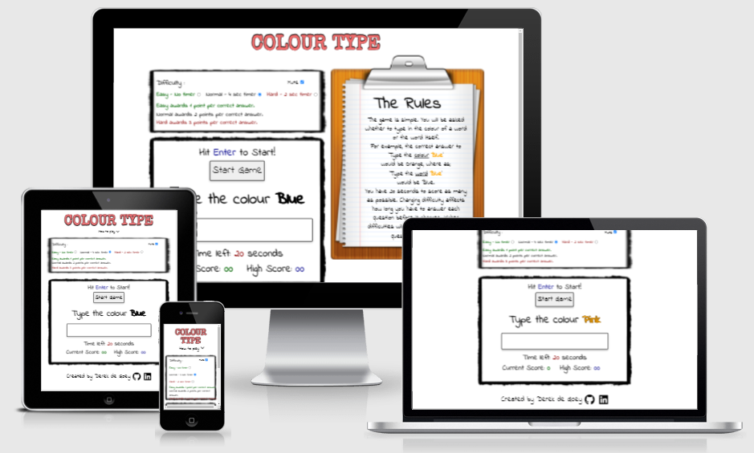
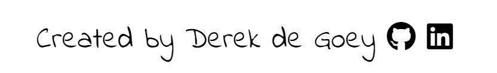

# Colour Type
Here is a link to the live project. (https://delboy.github.io/Colour-Type/)

Colour Type is a game that is inspired by a neuropsychological test called the stroop test. The test shows you a series of words that spell one colour but are coloured in another and asks you to speak out the colour of the word and not the word itself. I thought I could make this into a game where not only the word and colour changes but the question of whether to spell out either the word or the colour also changes. 

## Contents 

- [User Experience (UX)](#user-experience-ux)
   * [User Goals](#user-goals)
   * [Project Goals](#project-goals) 
   * [User Stories](#user-stories)
   
- [Design](#design)
   * [Colour Scheme](#colour-scheme)
   * [Typography](#typography)
   * [Imagery](#imagery)

- [Features](#features)
   * [Title](#title)
   * [Rule Area](#rule-area)
   * [Options Area](#options-area)
   * [Game Area](#game-area)
   * [Feedback Area](#feedback-area)
   * [Footer](#footer)

- [Technologies](#technologies)
   * [Languages used](#languages-used)
   * [Libraries & Programs Used](#libraries-and-programs-used)

- [Testing](#testing)
  
- [Deployment](#deployment)
   * [Creation](#creation)
   * [Github pages](#github-pages)
   * [Forking](#forking)
   * [Clone](#clone)

- [Credits](#credits)
   * [Code](#code)
   * [Media](#media)

## User Experience (UX)

### User Goals
- As a user I want to have some fun for a few minutes.
- As a user I want to develop my cognitive and typing skills.

### Project Goals
- As the site owner I want the user to have a fun experience.
- As the site owner I want the site to be responsive to all screen sizes.
- As the site owner I want the site to direct traffic to my other projects.

### User Stories
- As a user I want to be able to understand the rules of the game.
- As a user I want to understand how to play the game.
- As a user I want feedback on how I'm scoring.
- As a user I want the game to be enjoyable regardless of my skill.
- As a user I want the game to be aesthetically pleasing.

## Design

### Colour Scheme
- I wanted to keep the colour scheme plain and simple so as to not distract the user from the colouring of the question word. I liked the idea of the game looking like it was scribbled on a white board so I kept the main colours of the site black and white. 
### Typography
- The game uses 'indie flower' as its main font as it has a whiteboard pen-like handwriting quality which gives the page a school game feel. With the title I used 'Special Elite' for its typewriter look. I thought it suited the name of the game pretty well as your 'typing' out words. Sans sarif was used as a fallback font incase of any problems loading the page.
### Imagery
- To keep in line with the whiteboard, school like game, I used a black box border which resembles a black marker scribbling on the board, and a clipboard with some lined paper and some rough notes jotted down to make the rules.
- A spiral of colours was used as the favicon to reflect the nature of the game.
### Wireframes

* [Desktop](assets/readme-assets/wireframes/desktop.pdf)
* [Tablet](assets/readme-assets/wireframes/tablet.pdf)
* [Mobile](assets/readme-assets/wireframes/mobile.pdf)

- For the desktop version I wanted two columns. The left column being the options and game area with the rules being on the right.
- For tablets and phones I wanted only the left column to remain but sit in the center of the page. The rules column is initially hidden and displays in the center of the screen when the downward chevron is clicked.

## Features

### Title
- This title sits at the top of the page showing the user the name of the game as soon as they land on the site. Being that the game is all about colour I decided to animate the title to cycle through a bunch of different colours.

### Rule Area
- The rule area explains the rules of the game, giving two examples to aid the user. 
- If the user is on desktop then the rules are easily visible to the right of the game area. 
- If the user is on a smaller device, to save space, the rule area is initially hidden. Clicking the downward chevron next to the 'how to play' link displays the rules in the center of the screen.
- On tablet size screens touching the 'x' in the top right corner will close the rules, whereas touching the rules anywhere on mobile size screens will close it.

### Options Area
- Here the user can change the difficulty of the game and also choose whether to mute the sound or not. 
- Changing the difficulty does two things. It affects both the amount of time to answer each question and how many points are awarded for each question answered correctly. 
- The difficulty settings disables when the game starts and re-enables when the game ends. This is to stop the user from changing difficulty halfway through a round. 
- The mute checkbox can be checked and unchecked at any time during play.

### Game Area
- The game area consists of: 
     - A 'start game btn' which runs the game. This button disables once the game is running and re-enables when the game ends.
     - A question area where the current question will be displayed and a text box for the user to enter their answer.
     - A Timer showing how many seconds left till the game ends. 
     - A score area which displays the users current score and their high score.
- The enter/return key can also be used to start the game.
- The answer box will flash red for a split second if an incorrect answer is entered. It will also play an incorrect sound effect.
- If the user enters a correct answer it will play a correct sound effect.
- The timer also plays a 'ticking' sound effect every second that passes by.

### Feedback Area
- This section is hidden until the round finishes on which it will display a message to the user noting their score and possible new high score. It will also encourage them to play again. 
- If the user scores a new highscore a fanfare sound effect will play and the page will briefly flash through a range of colours.
- If the user doesn't beat their highscore a win sound effect will play.
- If the user scores 0 a lose sound effect will play and the message will ask the user if they read the rules.
- Hitting the enter/return key or clicking the feedback box will close it.

### Footer
- The footer displays my name and has social links to my linkedin and github pages. This will encourage users to check out my other work or potential employers to contact me.

## Technologies 

### Languages Used

-   [HTML5](https://en.wikipedia.org/wiki/HTML5)
-   [CSS3](https://en.wikipedia.org/wiki/Cascading_Style_Sheets)
-   [Javascript](https://en.wikipedia.org/wiki/JavaScript)

### Libraries and Programs Used

- [Google Fonts](https://fonts.google.com/)
    - Google fonts were used to import both fonts used. 
- [Font Awesome](https://fontawesome.com/)
    - Font awesome was used for the two social media icons, and the downward chevron in the rules dropdown.
- [GitHub](https://github.com/)
    - For storing code and deploying the site.
- [Gitpod](https://www.gitpod.io/)
    - Used for editing my code.
- [Balsamiq](https://balsamiq.com/)
    - To create my wireframes.
- [Am I responsive](http://ami.responsivedesign.is/)
    - To generate the image at the beginning of the README.
- [Chrome devtools](https://developer.chrome.com/docs/devtools/)
    - To troubleshoot with the console, change code before implementing, and to test responsiveness. 
- [TinyJPG](https://tinyjpg.com/)
    - I used TinyJPG to reduce the size of my images to reduce load times.

## Testing

Testing and results can be found [here](TESTING.md)

## Deployment

- ### Creation 

    To create a new repository I took the following steps:
    1. Logged into Github.
    2. Clicked over to the ‘repositories’ section.
    3. Clicked the green ‘new’ button. This takes you to the create new repository page.
    4. Once there under ‘repository template’ I chose the code institute template from the dropdown menu.
    5. I input a repository name then clicked the green ‘create repository button’ at the bottom of the page.
    6. Once created I opened the new repository and clicked the green ‘Gitpod’ button to create a workspace in Gitpod for editing.

- ### Github pages
    I deployed my project to Gihub pages by taking the following steps:

    1. Logged in to Github and opened my repository.
    2. Clicked settings.
    3. Selected the ‘pages’ section from the options on the left.
    4. From here I clicked the drop down menu under 'sources' and selected 'main'.
    5. After a couple minutes the page will be published and the site address will be available in the github page section.

    
- ### Forking

    To fork my project you must;
    1. Sign in to Github and go to my [repository](https://github.com/Delboy/Colour-Type)
    2. Locate the Fork button at the top right of the page.
    3. Select this. 
    4. The fork is now in your repositories.

- ### Clone
    To clone my project you must;

    1. Sign in to Github and go to my [repository](https://github.com/Delboy/Colour-Type)
    2. Above the list of files click the green ‘code’ button.
    3. This will bring up a few options as to how you would like to clone. You can select HTTPS, SSH or Github CLI, then click the clipboard icon to copy the URL.
    4. Open git bash
    5. Type ‘git clone’ and then paste the URL you copied. Press Enter.

    For more information on cloning check out the github documentation [here](https://docs.github.com/en/repositories/creating-and-managing-repositories/cloning-a-repository)

## Credits

### Code
- I learnt how to add audio from this thread on [stackoverflow.com](https://stackoverflow.com/questions/9419263/how-to-play-audio).
- I learnt how to give font an outline on this thread on [stackoverflow.com](https://stackoverflow.com/questions/4919076/outline-effect-to-text).
- I used [W3schools.com](https://www.w3schools.com/css/css3_animations.asp) to learn about animations which I used for the title, and for the colour changing backgrounds.
- I used [Flexboxfroggy.com](https://flexboxfroggy.com/) to learn how to use flexbox.
- I learnt how to hide code but still have it visible to screen readers from [W3.org](https://www.w3.org/WAI/tutorials/forms/labels/#note-on-hiding-elements). 

### Media
- All sounds were sourced from [Freesounds.org](https://freesound.org/).
- Clipboard pic was sourced from [subpng](https://www.subpng.com/png-co8iji/download.html).
- The border drawing was sourced from [PNGwing](https://www.pngwing.com/en/free-png-bbrpb).