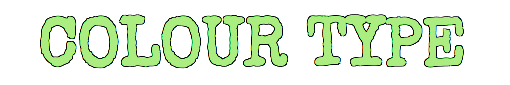
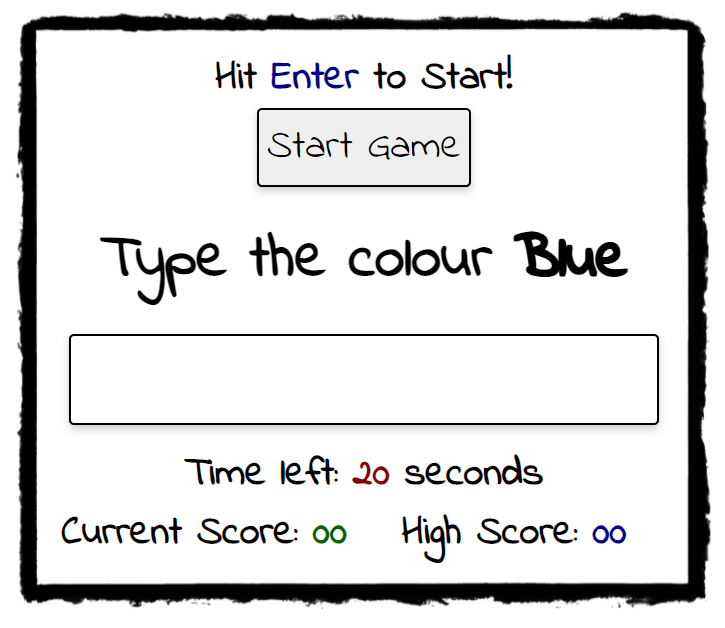

# Colour Type
Here is a link to the live project. (https://delboy.github.io/Colour-Type/)

Colour Type is a game that is inspired by a neuropsychological test called the stroop test. The test shows you a series of words that spell one colour but are coloured in another and asks you to speak out the colour of the word and not the word itself. I thought I could make this into a game where not only the word and colour changes but the question of whether to spell out either the word or the colour also changes. 

## User Experience (UX)

### User Goals
- As a user I want to have some fun for a few minutes.
- As a user I want to develop my cognitive and typing skills.

### Project Goals
- As the site owner I want the user to have a fun experience.
- As the site owner I want the site to be responsive to all screen sizes.
- As the site owner I want the site to direct traffic to my other projects.

### User Stories
- As a user I want to be able to understand the rules of the game.
- As a user I want to understand how to play the game.
- As a user I want feedback on how I'm scoring.
- As a user I want the game to be enjoyable regardless of my skill.
- As a user I want the game to be aesthetically pleasing.

## Design

### Colour Scheme
- I wanted to keep the colour scheme plain and simple as to not distract the user from the colouring of the question word. I liked the idea of the game looking like it was scribbled on a white board so I kept the main colours of the site black and white. 
### Typography
- The game uses 'indie flower' as its main font as it has a whiteboard pen-like handwriting quality which gives the page a school game feel. With the title I used 'Special Elite' for its typewriter look. I thought it suited the name of the game pretty well as your 'typing' out words. Sans sarif was used as a fallback font incase of any problems loading the page.
### Imagery
- To keep in line with the whiteboard, school like game, I used a black box border which resembles a black marker scribbling on the board, and a clipboard with some lined paper and some rough notes jotted down to make the rules.
- A spiral of colours was used as the favicon to reflect the nature of the game.
### Wireframes

* [Desktop](assets/readme-assets/wireframes/desktop.pdf)
* [Tablet](assets/readme-assets/wireframes/tablet.pdf)
* [Mobile](assets/readme-assets/wireframes/mobile.pdf)

- For the desktop version I wanted two columns. The left column being the options and game area with the rules being on the right.
- For tablets and phones I wanted only the left column to remain but sit in the center of the page. The rules column is initially hidden and displays in the center of the screen when the downward chevron is clicked.

## Features

### Title
- This title sits at the top of the page showing the user the name of the game as soon as they land on the site. Being that the game is all about colour I decided to animate the title to cycle through a bunch of different colours.

### Rule Area
- The rule area explains the rules of the game, giving two examples to aid the user. 
- On desktop the rules are easily visible to the right of the game area. 
- If using a smaller screen, to save space, the rule area is initially hidden. Clicking the downward chevron next to the 'how to play' link displays the rules in the center of the screen.
- On tablet size screens touching the 'x' in the top right corner will close the rules.
- On mobile size screens touching the rules anywhere will close it.

### Options Area
- Here the user can change the difficulty of the game and also choose whether to mute the sound or not. 
- Changing the difficulty does two things. It affects both the amount of time to answer each question and how many points are awarded for each question answered correctly. 
- The difficulty settings disables when the game starts and re-enables when the game ends. This is to stop the user from changing difficulty halfway through a round. 
- The mute checkbox can be checked and unchecked at any time during play.

### Game Area
- The game area consists of: 
     - A 'start game btn' which runs the game. This button disables once the game is running and re-enables when the game ends.
     - A question area where the current question will be displayed and a text box for the user to enter their answer.
     - A Timer showing how many seconds left till the game ends. 
     - A score area which displays the users current score and their high score.
- The enter/return key can also be used to start the game.
- The answer box will flash red for a split second if an incorrect answer is entered. It will also play an incorrect sound effect.
- If the user enters a correct answer it will play a correct sound effect.
- The timer also plays a 'ticking' sound effect every second that passes by.

### Feedback Area
- This section is hidden until the round finishes on which it will display a message to the user noting them of their score and possible new high score. It will also encourage them to play again. 
- If the user scores a new highscore a fanfare sound effect will play and the page will briefly flash through a range of colours.
- If the user doesn't beat their highscore a win sound effect will play.
- If the user scores 0 a lose sound effect will play and the message will ask the user if they read the rules.
- Hitting the enter/return key or clicking the feedback box will close it.

<

### Footer
- The footer displays my name and has social links to my linkedin and github pages. This will encourage users to check out my other work or potential employers to contact me.

## Testing

### User stories Testing

*As a user I want to be able to understand the rules of the game.*
- If on desktop the user can see the rules of the game as soon as they land on the page.
- If on smaller devices the rules are easily accessible from a dropdown menu.
- Inside the rules two examples are given to help aid the user understand the game.
- If the user scores 0 the feedback box at the end of the round will encourage the user to read the rules. 

*As a user I want playing the game to be intuitive.*
- The amount of controls needed for the game were kept minimal.
- There is only one button on the entire site that the user needs which is the start button.
- Starting the game automatically focuses the answer box meaning the user can begin punching in answers straight away withouting having to manually click it.
- There is also a visual cue letting the user know that they can hit the enter key instead to start the game.

*As a user I want feedback on how I'm scoring.*
- Inside the game area there is a scoreboard that updates in real time.
- Inside the game area there is a scoreboard for your highscore that updates at the end of each round.
- Audio cues let the user know if they are answering correctly or not.
- Visual cues such as the answer box flashing red for incorrect answers also help aid the user to how well they’re doing.
- The feedback box at the end of the round will display your score and your highscore.
- If the user beats their highscore then the page will play a fanfare sound effect and flash the screen through multiple colours for a few seconds.

*As a user I want the game to be enjoyable regardless of my skill.*
- The user can change the difficulty in the game by reducing the amount of time they have to answer each question correctly.
- More points are awarded for higher difficulties which encourages the user to keep playing so that they can increase their skill and eventually score higher. 

*As a user I want the game to be aesthetically pleasing.* 
- The imagery chosen was to make the site look fun and unthreatening. 
- The theme was a school game that had been scribbled onto a whiteboard. 
- The rules were made to look like they had been jotted down onto some scrap paper on a clipboard.
- The font and boxes were made to look like they had been written with a whiteboard marker.
- The game was kept very minimalistic and colours kept to a minimum for two reasons:
1. To keep the game clear and concise with nothing to distract the user.
2. So the colour of the word in the question would not clash with anything in its surroundings. 

### Validators
- HTML
    - No errors were returned when passing through the official [W3C validator](https://validator.w3.org/nu/?doc=https%3A%2F%2Fdelboy.github.io%2FColour-Type%2F)
- CSS
    - No errors were found when passing through the official [(Jigsaw) validator](https://jigsaw.w3.org/css-validator/validator?uri=https%3A%2F%2Fdelboy.github.io%2FColour-Type%2F&profile=css3svg&usermedium=all&warning=1&vextwarning=&lang=en)
- JavaScript
    - No errors were found when passing through the official [Jshint validator](https://jshint.com/)
    - The following metrics were returned
    - There are 24 functions in this file.
    - Function with the largest signature take 1 arguments, while the median is 0.
    - Largest function has 34 statements in it, while the median is 4.
    - The most complex function has a cyclomatic complexity value of 5 while the median is 2.
### Further Testing

- Testing was done throughout development using a combination of Chrome Developer tools and console logs. Each Time a new function was created a console log was used before the relevant code was implemented to ensure that the function was wired up correctly.
- The site was tested on google chrome, edge, firefox and safari browsers.
- The site was viewed on multiple devices such as desktop (including an ultra wide monitor), iphone, ipad, ipad mini, and laptop.
- Responsiveness was tested using google chrome dev tools to check multiple device sizes.
- All links were checked extensively to make sure they direct the user to the correct location.
- The game was played extensively using variations of all possible options.
- Score and highscores were checked to make sure they update correctly across all game difficulties.
- Sound was tested to make sure nothing is played when the game is muted. 

### Bugs

 - The sound effects on do not sync up with the game correctly when played on a phone or tablet.
 - The background animation that triggers when you beat yourscore causes distortion on some elements when viewed on a phone or tablet.

## Deployment

## Credits
- I learned how to add audio from [this] thread (https://stackoverflow.com/questions/9419263/how-to-play-audio) on stackoverflow.com.
- All sounds were sourced from [Freesounds.org](https://freesound.org/).
- Clipboard pic was sourced from https://www.subpng.com/png-co8iji/download.html.
- Box https://www.pngwing.com/en/free-png-bbrpb