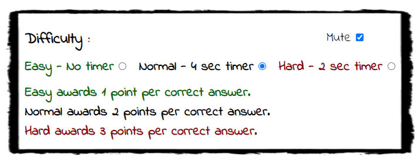
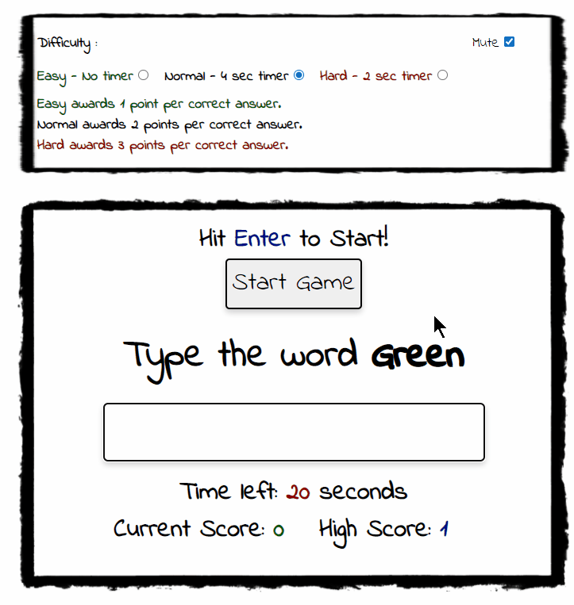

# Colour Type - Testing

## Contents 

- [Validators](#validators)
- [User stories testing](#user-stories-testing)
- [Feature Testing](#feature-testing)
    * [Rules Area](#rules-area)
    * [Options Area](#options-area)
    * [Game Area](#game-area)
    * [Feedback Area](#feedback-area)
    * [Footer](#footer)
    * [Misc](#misc)
- [Further Testing](#further-testing)
- [Bugs](#bugs)

## Validators
- HTML
    - No errors were returned when passing through the official [W3C validator](https://validator.w3.org/nu/?doc=https%3A%2F%2Fdelboy.github.io%2FColour-Type%2F)

- CSS
    - No errors were found when passing through the official [(Jigsaw) validator](https://jigsaw.w3.org/css-validator/validator?uri=https%3A%2F%2Fdelboy.github.io%2FColour-Type%2F&profile=css3svg&usermedium=all&warning=1&vextwarning=&lang=en)

- JavaScript
    - No errors were found when passing through [Jshint](https://jshint.com/)

   

- Lighthouse 
    - No issues with lighthouse on both desktop and mobile.
        * Desktop 

        

        * Mobile

        

## User stories Testing

*As a user I want to be able to understand the rules of the game.*
- If on desktop the user can see the rules of the game as soon as they land on the page.
- If on smaller devices the rules are easily accessible from a dropdown menu.
- Inside the rules two examples are given to help aid the user understand the game.
- If the user scores 0 the feedback box at the end of the round will encourage the user to read the rules. 

*As a user I want playing the game to be intuitive.*
- The amount of controls needed for the game were kept minimal.
- There is only one button on the entire site that the user needs which is the start button.
- Starting the game automatically focuses the answer box meaning the user can begin punching in answers straight away withouting having to manually click it.
- There is also a visual cue letting the user know that they can hit the enter key instead to start the game.

*As a user I want feedback on how I'm scoring.*
- Inside the game area there is a scoreboard that updates in real time.
- Inside the game area there is a scoreboard for your highscore that updates at the end of each round.
- Audio cues let the user know if they are answering correctly or not.
- Visual cues such as the answer box flashing red for incorrect answers also help aid the user to how well they’re doing.
- The feedback box at the end of the round will display your score and your highscore.
- If the user beats their high score then the page will play a fanfare sound effect and flash the screen through multiple colours for a few seconds.

*As a user I want the game to be enjoyable regardless of my skill.*
- The user can change the difficulty in the game by reducing the amount of time they have to answer each question correctly.
- More points are awarded for higher difficulties which encourages the user to keep playing so that they can increase their skill and eventually score higher. 

*As a user I want the game to be aesthetically pleasing.* 
- The imagery chosen was to make the site look fun and unthreatening. 
- The theme was a school game that had been scribbled onto a whiteboard. 
- The rules were made to look like they had been jotted down onto some scrap paper on a clipboard.
- The font and boxes were made to look like they had been written with a whiteboard marker.
- The game was kept very minimalistic and colours kept to a minimum for two reasons:
1. To keep the game clear and concise with nothing to distract the user.
2. So the colour of the word in the question would not clash with anything in its surroundings. 

## Feature Testing

### Header

- Checked if clicking header refreshed the page.

### Rules Area

- Checked if clicking downward chevron opens rules on both phone and tablet screen sizes.
- Checked if the close button works on rules for tablets.

- Checked if touching/clicking anywhere inside rules closes it on phone screens. <em>*note bugs</em>

- Checked that clicking the downward chevron whilst the game is running still brings up the rules.

- Checked that when the feedback box is showing and the downward chevron is clicked that it still brings up rules but keeps them behind the feedback box.

- Checked that the click sound effect played when opening/closing rules if the game is unmuted.

### Options Area

- Selected each difficulty option and checked how long each question stayed on screen before changing, making sure it matches what was intended.

- Checked that the difficulty couldnt be changed whilst the game was active.

- Checked that mute box was clickable at all times. 

- Checked that toggling mute box during play enabled and disabled sounds.
- Checked that the answer box is focused after changing any options.
- Checked that all sounds didn't play whilst mute box was checked.
- Checked that all sounds played whilst mute box was unchecked.

### Game Area

- Checked if clicking the 'start game' button began the game.

- Checked that the 'start game' button wasn't clickable whilst game was already running.

- Checked that the 'start game' button changed colour when hovered over.

- Checked that the question consistently randomised the word and its colour.

- If answer is incorrect checked that the answer box was cleared, flashed red and the incorrect sound effect was played.

- If answer is correct checked that the answer box was cleared, score increased inline with difficulty chosen, and the correct sound effect was played.

- Checked that the answer box was not caps-sensitve.

- Checked that the game timer counted down from 20 correctly.

- Checked that when a question was answered correctly the current score increased inline with the difficulty chosen.

- Checked that the current score reset after the game ends.

- Checked that the high score updated if beaten once the game ended. 

- Checked that the 'start game' button is focused when the page loads.
- Checked that hitting the Enter key functioned the same as clicking the 'start game' button if the answer box is focused and the game was not already running.
- Checked that typing an answer into the answer box and hitting enter ran the function that checked if the answer is correct.
- Checked that the tick sound effect played in time with the time-left counter if the game is unmuted.
- Checked that the win sound effect plays if highscore was not beaten.
- Checked that the fanfare sound effect plays if highscore was beaten.
- Checked that the lose sound effect plays if the user scores zero.

### Feedback Area

- Checked that the feedback box appears after the game ends.
- Checked that clicking the feedback box close button closes the box.

- Checked that clicking the feedback box on phone size screens closed it.

- Checked that the feedback box message reflects what the users scored.
- Check that the feedback box displays the correct message depending on the user's actions.
- Checked that the main game area is greyed out whilst the feedback box is visible and returns to normal once closed.

- Checked that the background colour animation plays only if the high score is beaten.

- Checked that the game could not be started when the feedback box is visible.

### Footer

- Checked that the social links aren't broken.
- Checked that the social links open a separate browser window.

### Misc

- Checked that site was responsive

- Checked that the cursor turned to a pointer when hovering over a clickable element

## Further Testing

- Testing was done throughout development using a combination of Chrome Developer tools and console logs. Each Time a new function was created a console log was used before the relevant code was implemented to ensure that the function was wired up correctly.
- The site was tested on google chrome, edge, firefox and safari browsers.
- The site was viewed on multiple devices such as desktop (including an ultra wide monitor), iphone, ipad, ipad mini, and laptop.
- Responsiveness was tested using google chrome dev tools to check multiple device sizes.

### Bugs

 - The sound effects do not sync up with the game correctly when played on a phone or tablet.
 - The background animation that triggers when you beat your high score causes distortion on some elements when viewed on a phone or tablet.
 - *When using chrome dev tools if you resize the page to under 700px then you have to refresh the page for the rule section to close when clicked/touched.